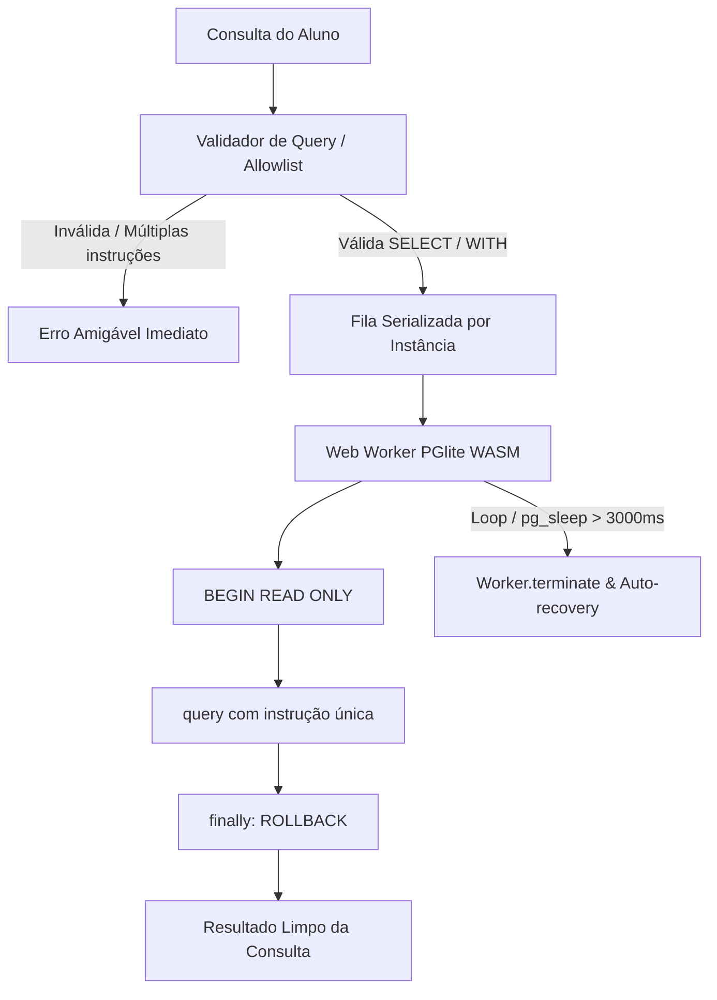

# Arquitetura Técnica — SQL & Linux Lab

Este documento detalha os princípios arquiteturais, a separação de responsabilidades, as garantias de segurança e o funcionamento interno dos motores de execução do **SQL & Linux Lab**.

---

## 1. Visão Geral e Filosofia

O **SQL & Linux Lab** é uma plataforma educacional para prática de SQL e conceitos de sistemas executada **100% no navegador do usuário (client-side)**.

### Princípios Norteadores:
1. **Zero Backend**: Sem servidores de aplicação, sem containers em execução no servidor, sem WebSockets e sem banco de dados centralizado.
2. **Execução Real**: O SQL não é simulado por regex ou mock — ele roda em uma instância real de PostgreSQL compilada para WebAssembly ([PGlite](https://pglite.electric-sql.com)).
3. **Desacoplamento Rigoroso**:
   $$\text{Conteúdo} \neq \text{Aplicação} \neq \text{Motor de Execução} \neq \text{Persistência}$$
   - **Conteúdo**: Arquivos JSON declarativos e scripts SQL puros.
   - **Motor (Engines)**: Pacotes TypeScript puros e isomórficos, desacoplados de qualquer framework de UI.
   - **Aplicação**: Camada visual em React + Vite consumindo os motores via APIs tipadas.
   - **Persistência**: IndexedDB local com fallback resiliente para memória.

---

## 2. Estrutura do Monorepo

O projeto é organizado como um monorepo gerenciado por `pnpm workspaces`:

```
sql-linux-lab/
├── apps/
│   └── web/                   # Interface React + Vite (SPA estática)
├── packages/
│   ├── shared/                # Contratos, tipos comuns, schemas Zod e content loader
│   ├── sql-engine/            # Wrapper do PGlite, isolamento, pool LRU e Web Worker
│   ├── exercise-engine/       # Avaliador pedagógico e comparador semântico de resultados
│   ├── progression-engine/    # Gerenciador de perfis locais, IndexedDB e smart merge
│   ├── linux-lab/             # [Fase 2] Shell virtual emulado e VFS em memória
│   ├── docker-lab/            # [Fase 3] Simulador de comandos Docker CLI
│   └── network-lab/           # [Fase 3] Simulador de redes, curl e inspeção HTTP
├── content/
│   └── sql/
│       ├── datasets/          # Scripts DDL/DML de dados de exemplo (ex: alunos.sql)
│       └── exercises/         # Exercícios em formato JSON estruturado
├── infrastructure/
│   └── docker/                # Multi-stage Dockerfile e configuração Nginx
└── docs/                      # Documentação de arquitetura e especificação de conteúdo
```

---

## 3. Isolamento e Segurança do Motor SQL (`@lab/sql-engine`)

Como o código SQL digitado pelo aluno roda dentro do navegador, a engine precisa impedir efeitos colaterais acidentais, mutações que corrompam o dataset durante a sessão e travamentos da interface.



### 3.1. Allowlist Estrita (Sem Blocklists Frágeis)
- Rejeitamos a abordagem de blocklist (ex: procurar por palavras como `DROP` ou `DELETE`), pois ela é suscetível a falsos positivos em identificadores ou literais de texto.
- Implementamos **allowlist sintática**: após remover comentários SQL (`--` e `/* */`) e espaços em branco, a instrução deve obrigatoriamente iniciar com `SELECT`, `WITH` ou `(SELECT`.
- Múltiplas instruções separadas por ponto e vírgula são rejeitadas nativamente pelo método `query()`.

### 3.2. Transação READ ONLY e Rollback Garantido
- Toda execução de consulta do aluno é envolvida em uma transação explicitamente declarada como somente leitura:
  ```sql
  BEGIN READ ONLY;
  -- [instrução do aluno via query()]
  -- executada em bloco try ... finally
  ROLLBACK;
  ```
- O `ROLLBACK` é executado incondicionalmente no bloco `finally`, restaurando o estado limpo da conexão mesmo se a consulta falhar com erro de sintaxe.
- Caso o usuário tente executar comandos de escrita suportados sintaticamente dentro de CTEs, o PostgreSQL dispara o erro `25006` (`read_only_sql_transaction`), que é traduzido amigavelmente.

### 3.3. Ciclo de Vida do Web Worker e Tratamento de Timeout
- Em ambientes WebAssembly single-threaded, sinais POSIX não existem; portanto, `SET statement_timeout` não interrompe laços infinitos ou operações bloqueantes no PGlite.
- Para garantir que uma query pesada (ex: `SELECT pg_sleep(10)`) não congele o ambiente:
  1. A execução roda dentro de um **Web Worker** dedicado (no navegador) ou `worker_threads` (em testes no Node.js).
  2. Um timer de timeout (padrão: 3000 ms) monitora a query.
  3. Se o timeout estourar, o cliente chama `worker.terminate()`, abortando o WASM imediatamente.
  4. O `SqlWorkerClient` executa **auto-recovery**: a instância abortada é descartada e uma nova instância limpa é recriada sob demanda em segundo plano.

### 3.4. Cache LRU de Instâncias
- Inicializar o WebAssembly do PGlite e rodar os scripts DDL/DML de setup consome tempo.
- O `InstanceCache` mantém até 3 instâncias ativas em memória, indexadas pelo identificador do dataset. Ao alternar entre exercícios do mesmo dataset, a execução é quase instantânea.

---

## 4. Avaliador Pedagógico e Comparador Semântico (`@lab/exercise-engine`)

O avaliador não compara strings de SQL. Ele executa a consulta do aluno e as consultas de referência do professor em instâncias isoladas do banco de dados e analisa as diferenças semânticas entre os `SqlQueryResult`.

### 4.1. Hierarquia de Status
1. **`correct` (🟢)**:
   - Quantidade de colunas idêntica.
   - Nomes de colunas ou aliases idênticos (case-insensitive).
   - Dados das linhas exatamente equivalentes.
   - Respeito à ordenação (`orderMatters: true` exige ordem idêntica; `orderMatters: false` aceita qualquer ordem válida).
2. **`almost` (🟡)**:
   - As linhas de dados foram filtradas corretamente, mas:
     - Uma coluna foi renomeada com alias diferente.
     - A ordem das colunas projetadas diverge do gabarito.
     - Há uma coluna extra ou faltante na projeção.
     - A cláusula `ORDER BY` foi omitida quando a ordenação era exigida.
3. **`wrong` (🔴)**:
   - Erro de sintaxe SQL ou violação de permissão.
   - Linhas retornadas não correspondem ao resultado esperado.
   - Múltiplas instruções ou tentativa de mutação de dados.

### 4.2. Normalização de Tipos e Equivalência Numérica
Drivers PostgreSQL frequentemente representam colunas `numeric` e `bigint` como strings (ex: `"150.00"`). O `comparator.ts` faz normalização semântica:
- `"150.00"` e `150` são tratados como numericamente equivalentes.
- `null` e `undefined` são unificados como nulos de banco de dados.

### 4.3. Ordenação Determinística para `orderMatters: false`
Quando a ordem das linhas não importa:
- Cada linha (objeto chave-valor) tem suas chaves ordenadas alfabeticamente e é serializada de forma canônica.
- O conjunto completo de linhas é ordenado antes da comparação, garantindo estabilidade e determinismo independente da ordem de retorno do motor de busca.

### 4.4. Seleção da Melhor Solução (Best-Match)
Um exercício pode declarar múltiplas soluções de referência (`solutions: string[]`). O avaliador compara a query do aluno contra todas as soluções e seleciona o melhor resultado segundo a ordem de prioridade: `correct > almost > wrong`.

---

## 5. Persistência Local e Gerenciador de Perfis (`@lab/progression-engine`)

Toda a persistência é local e offline-first:

```mermaid
flowchart LR
    A[ProgressionEngine] --> B[StorageAdapter Interface]
    B --> C[IndexedDbAdapter (Navegador)]
    B --> D[MemoryStorageAdapter (Vitest / Incognito)]
    C --> E[(IndexedDB: sql_linux_lab_db)]
```

### 5.1. Interface Desacoplada (`StorageAdapter`)
- Define operações assíncronas para perfis, tentativas e progresso.
- **`IndexedDbAdapter`**: Utiliza IndexedDB nativo com três object stores:
  - `profiles`: metadados dos perfis criados pelo usuário.
  - `progress`: chave composta `${profileId}::${exerciseId}` com índice secundário `by_profileId`.
  - `settings`: armazena o perfil ativo atual (`activeProfileId`).
- **`MemoryStorageAdapter`**: Mantém mapas em memória, viabilizando execução instantânea em testes automatizados.
- **`createAutoStorageAdapter()`**: Tenta inicializar o IndexedDB; se falhar (por exemplo, em modo anônimo de navegadores restritivos), comuta transparentemente para memória.

### 5.2. Criação Automática do Perfil Padrão
No primeiro carregamento da aplicação, o sistema cria automaticamente o perfil `"Estudante"` e o define como ativo, eliminando qualquer tela de cadastro ou fricção inicial.

### 5.3. Validação e Smart Merge no Import/Export
- **Exportação**: Gera um arquivo JSON contendo a versão do schema (`version: 1`), timestamp e a lista completa de perfis e progressos.
- **Validação**: Schema Zod estrito (`ProgressExportDataSchema`) valida a integridade antes de qualquer mutação.
- **Smart Merge**:
  - **Preservação de Conclusão**: Se um exercício já foi concluído localmente ou no arquivo importado, o status `completed: true` é estritamente mantido.
  - **Desduplicação de Tentativas**: Históricos de tentativas são unificados sem duplicatas e reordenados cronologicamente.
  - **Timestamps**: A primeira data de conclusão (`firstCompletedAt`) mais antiga é preservada.

---

## 6. Servidor e Headers de Isolamento WebAssembly

Para tirar o máximo proveito de WebAssembly multithreading e isolamento de Workers sem restrições em navegadores modernos, o servidor Nginx Alpine injeta os seguintes headers de segurança:

```nginx
add_header Cross-Origin-Opener-Policy "same-origin" always;
add_header Cross-Origin-Embedder-Policy "require-corp" always;
add_header X-Content-Type-Options "nosniff" always;
add_header X-Frame-Options "SAMEORIGIN" always;
```

Estes headers garantem o isolamento de processo e o contexto seguro necessário para bibliotecas de alta performance no browser.
